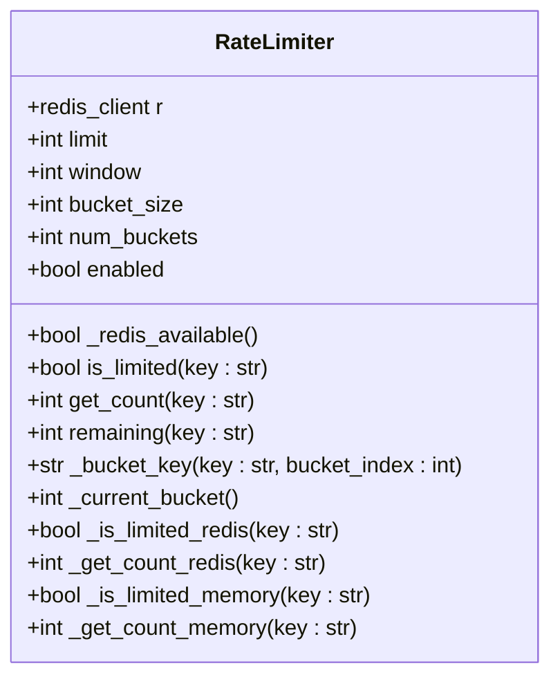
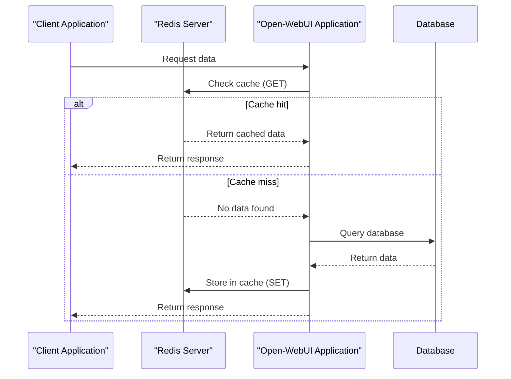
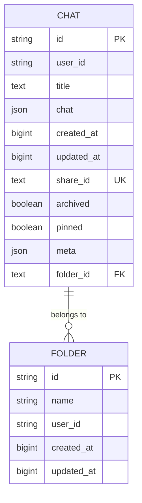
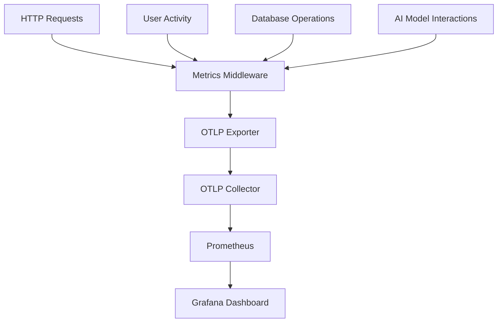
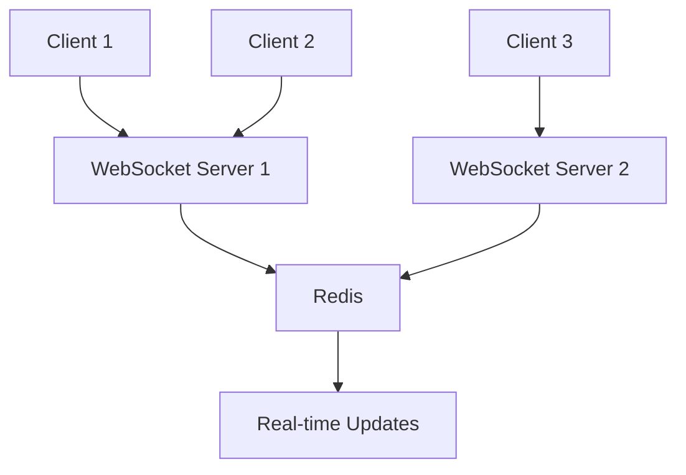
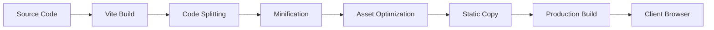

# Performance Optimization

<cite>
**Referenced Files in This Document**   
- [rate_limit.py](file://backend/open_webui/utils/rate_limit.py)
- [redis.py](file://backend/open_webui/utils/redis.py)
- [setup.py](file://backend/open_webui/utils/telemetry/setup.py)
- [metrics.py](file://backend/open_webui/utils/telemetry/metrics.py)
- [instrumentors.py](file://backend/open_webui/utils/telemetry/instrumentors.py)
- [middleware.py](file://backend/open_webui/utils/middleware.py)
- [socket/main.py](file://backend/open_webui/socket/main.py)
- [env.py](file://backend/open_webui/env.py)
- [chats.py](file://backend/open_webui/models/chats.py)
- [vite.config.ts](file://vite.config.ts)
</cite>

## Table of Contents
1. [Introduction](#introduction)
2. [Rate Limiting System](#rate-limiting-system)
3. [Caching Strategies with Redis](#caching-strategies-with-redis)
4. [Database Query Optimization](#database-query-optimization)
5. [Monitoring System Metrics](#monitoring-system-metrics)
6. [WebSocket Connection Optimization](#websocket-connection-optimization)
7. [Backend Service Tuning for High Concurrency](#backend-service-tuning-for-high-concurrency)
8. [Frontend Rendering and Asset Loading Optimization](#frontend-rendering-and-asset-loading-optimization)
9. [Performance Bottlenecks in Middleware and Telemetry](#performance-bottlenecks-in-middleware-and-telemetry)

## Introduction
This document provides comprehensive guidance on performance optimization for open-webui, focusing on identifying and resolving slow response times, high memory usage, and latency in AI model interactions. The document covers key performance aspects including rate limiting, caching strategies, database optimization, monitoring, WebSocket connections, and frontend rendering. By implementing the strategies outlined in this document, administrators and developers can significantly improve the responsiveness and scalability of the open-webui application.

## Rate Limiting System
The open-webui platform implements a robust rate limiting system to prevent abuse and ensure fair resource allocation among users. The system uses a rolling window strategy with Redis as the primary storage mechanism, with an in-memory fallback when Redis is unavailable.

The `RateLimiter` class in `backend/open_webui/utils/rate_limit.py` provides the core functionality for rate limiting. It allows configuration of key parameters such as the request limit, time window, and bucket size. The system gracefully handles Redis failures by falling back to in-memory storage, ensuring that rate limiting continues to function even when the Redis service is unavailable.

**Diagram sources**
- [rate_limit.py](file://backend/open_webui/utils/rate_limit.py#L6-L140)

**Section sources**
- [rate_limit.py](file://backend/open_webui/utils/rate_limit.py#L6-L140)

## Caching Strategies with Redis
Redis plays a critical role in the open-webui performance optimization strategy, serving as the primary caching mechanism for various application components. The system uses Redis for rate limiting, session management, and real-time collaboration features.

The Redis client configuration in `backend/open_webui/utils/redis.py` supports multiple deployment scenarios including standalone Redis, Redis Sentinel for high availability, and Redis Cluster for horizontal scaling. The connection management system includes connection pooling and automatic reconnection capabilities to ensure reliability.

**Diagram sources**
- [redis.py](file://backend/open_webui/utils/redis.py#L1-L231)
- [rate_limit.py](file://backend/open_webui/utils/rate_limit.py#L6-L140)

**Section sources**
- [redis.py](file://backend/open_webui/utils/redis.py#L1-L231)
- [rate_limit.py](file://backend/open_webui/utils/rate_limit.py#L6-L140)

## Database Query Optimization
The open-webui application implements several database optimization techniques to improve query performance and reduce latency. The primary database is SQLite, with support for other database types through SQLAlchemy.

Key optimization strategies include:
- Indexing critical columns to speed up query execution
- Connection pooling to reduce database connection overhead
- Query batching to minimize round trips
- Prepared statements to improve query plan reuse

The `Chat` model in `backend/open_webui/models/chats.py` demonstrates effective indexing strategies with multiple composite indexes on frequently queried columns such as `user_id`, `folder_id`, `pinned`, and `archived`. These indexes significantly improve the performance of common operations like retrieving user chats, filtering by folder, and sorting by update time.

**Diagram sources**
- [chats.py](file://backend/open_webui/models/chats.py#L26-L56)
- [folders.py](file://backend/open_webui/models/folders.py)

**Section sources**
- [chats.py](file://backend/open_webui/models/chats.py#L26-L56)

## Monitoring System Metrics
The open-webui platform includes comprehensive monitoring capabilities through OpenTelemetry integration. The system collects and exports metrics that provide insights into application performance, user activity, and system health.

The metrics system in `backend/open_webui/utils/telemetry/metrics.py` collects key performance indicators including:
- HTTP request counts and durations
- Active user counts (current and daily)
- Total registered users

These metrics are exported to an OTLP collector, which can expose them to Prometheus for visualization and alerting. The system uses views to limit cardinality and prevent high-cardinality label sets that could impact performance.

**Diagram sources**
- [metrics.py](file://backend/open_webui/utils/telemetry/metrics.py#L1-L204)
- [setup.py](file://backend/open_webui/utils/telemetry/setup.py#L1-L59)

**Section sources**
- [metrics.py](file://backend/open_webui/utils/telemetry/metrics.py#L1-L204)
- [setup.py](file://backend/open_webui/utils/telemetry/setup.py#L1-L59)

## WebSocket Connection Optimization
WebSocket support in open-webui enables real-time collaboration and instant updates. The system is optimized for high concurrency and low latency through several configuration options and architectural choices.

The WebSocket configuration in `backend/open_webui/env.py` includes tunable parameters for:
- Ping interval and timeout settings
- Redis connection options for distributed environments
- Lock timeout for cleanup operations
- Logging levels for debugging

The system uses Redis as a message broker when `WEBSOCKET_MANAGER` is set to "redis", enabling horizontal scaling across multiple application instances. This architecture allows users to maintain real-time connections even when load balancing across multiple servers.

**Diagram sources**
- [socket/main.py](file://backend/open_webui/socket/main.py#L1-L839)
- [env.py](file://backend/open_webui/env.py#L613-L662)

**Section sources**
- [socket/main.py](file://backend/open_webui/socket/main.py#L1-L839)
- [env.py](file://backend/open_webui/env.py#L613-L662)

## Backend Service Tuning for High Concurrency
Optimizing backend services for high concurrency involves tuning various system parameters and architectural components. The open-webui platform provides several configuration options to optimize performance under heavy load.

Key tuning parameters include:
- UVICORN_WORKERS: Number of worker processes for handling requests
- DATABASE_POOL_SIZE: Maximum number of database connections in the pool
- DATABASE_POOL_MAX_OVERFLOW: Maximum number of overflow connections
- DATABASE_POOL_TIMEOUT: Timeout for acquiring a database connection
- DATABASE_POOL_RECYCLE: Time before connections are recycled

These parameters should be tuned based on the available system resources and expected load patterns. For high-concurrency environments, increasing the number of Uvicorn workers and database connection pool size can significantly improve throughput.

**Section sources**
- [env.py](file://backend/open_webui/env.py#L399-L408)
- [env.py](file://backend/open_webui/env.py#L312-L349)

## Frontend Rendering and Asset Loading Optimization
The frontend performance of open-webui is optimized through modern build tools and asset management strategies. The Vite-based build system in `vite.config.ts` implements several optimization techniques.

Key frontend optimizations include:
- Code splitting to reduce initial load time
- Asset compression and minification
- Static asset copying for WASM modules
- Environment-specific build optimizations
- Source map generation for debugging

The build configuration also includes tree-shaking to eliminate unused code and dead code elimination to reduce bundle sizes. These optimizations result in faster page loads and improved runtime performance.

**Diagram sources**
- [vite.config.ts](file://vite.config.ts#L1-L33)

**Section sources**
- [vite.config.ts](file://vite.config.ts#L1-L33)

## Performance Bottlenecks in Middleware and Telemetry
While middleware and telemetry systems provide valuable functionality, they can introduce performance bottlenecks if not properly configured. The open-webui platform includes several potential performance considerations in these areas.

The telemetry system in `backend/open_webui/utils/telemetry/instrumentors.py` instruments various components including FastAPI, SQLAlchemy, Redis, and HTTP clients. While this provides comprehensive monitoring, it can add overhead to request processing. The system includes hooks to customize the instrumentation behavior and reduce performance impact.

Rate limiting and caching middleware in `backend/open_webui/utils/middleware.py` can also impact performance, particularly when Redis is unavailable and the system falls back to in-memory storage. Monitoring the performance of these middleware components is essential to identify and resolve bottlenecks.

**Section sources**
- [instrumentors.py](file://backend/open_webui/utils/telemetry/instrumentors.py#L1-L203)
- [middleware.py](file://backend/open_webui/utils/middleware.py#L1-L800)