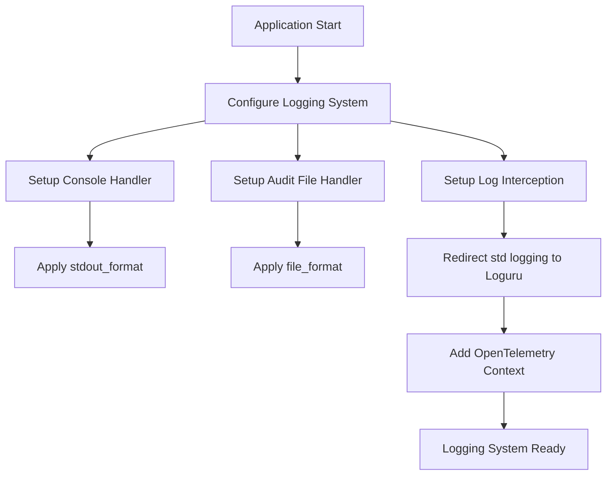
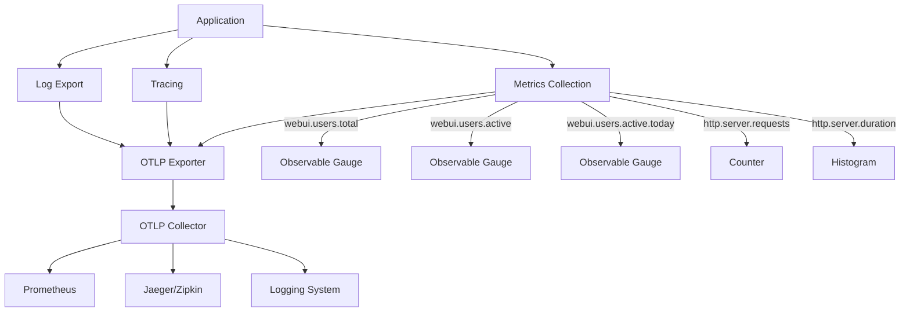

# Troubleshooting and Operations

<cite>
**Referenced Files in This Document**   
- [TROUBLESHOOTING.md](file://TROUBLESHOOTING.md)
- [logger.py](file://backend/open_webui/utils/logger.py)
- [setup.py](file://backend/open_webui/utils/telemetry/setup.py)
- [logs.py](file://backend/open_webui/utils/telemetry/logs.py)
- [metrics.py](file://backend/open_webui/utils/telemetry/metrics.py)
- [main.py](file://backend/open_webui/main.py)
- [db.py](file://backend/open_webui/internal/db.py)
- [env.py](file://backend/open_webui/env.py)
- [config.py](file://backend/open_webui/config.py)
- [docker-compose.yaml](file://docker-compose.yaml)
- [utils.py](file://backend/open_webui/routers/utils.py)
- [redis.py](file://backend/open_webui/utils/redis.py)
</cite>

## Table of Contents
1. [Common Installation and Configuration Issues](#common-installation-and-configuration-issues)
2. [Runtime Problems and Connectivity Issues](#runtime-problems-and-connectivity-issues)
3. [Logging System and Log Interpretation](#logging-system-and-log-interpretation)
4. [Telemetry and Monitoring Capabilities](#telemetry-and-monitoring-capabilities)
5. [Diagnostic Procedures for Performance and Authentication](#diagnostic-procedures-for-performance-and-authentication)
6. [Health Check Endpoints and System Status Monitoring](#health-check-endpoints-and-system-status-monitoring)
7. [Database Troubleshooting and Migration Issues](#database-troubleshooting-and-migration-issues)
8. [Cache-Related Problems](#cache-related-problems)
9. [Operational Best Practices for Production](#operational-best-practices-for-production)
10. [Performance Optimization Techniques](#performance-optimization-techniques)

## Common Installation and Configuration Issues

When installing and configuring open-webui, several common issues may arise. The most frequent installation problem occurs when the WebUI Docker container cannot reach the Ollama server at 127.0.0.1:11434 (host.docker.internal:11434) inside the container. This can be resolved by using the `--network=host` flag in the Docker command, which changes the port from 3000 to 8080, resulting in the link: `http://localhost:8080`.

For configuration issues, ensure that the OLLAMA_BASE_URL environment variable is correctly set. When running the Web UI container, verify that the OLLAMA_BASE_URL is properly configured (e.g., `http://192.168.1.1:11434` for different host setups). In the Open WebUI interface, navigate to "Settings" > "General" and confirm that the Ollama Server URL is correctly set to `[OLLAMA URL]` (e.g., `http://localhost:11434`).

Another common configuration issue relates to database setup. The system automatically migrates from Ollama-WebUI to open-webui by renaming `ollama.db` to `webui.db` if the file exists in the data directory. For PostgreSQL configuration, ensure the database URL is properly formatted in the docker-compose.yaml file with the correct credentials and connection details.

**Section sources**
- [TROUBLESHOOTING.md](file://TROUBLESHOOTING.md#L1-L37)
- [docker-compose.yaml](file://docker-compose.yaml#L1-L60)
- [env.py](file://backend/open_webui/env.py#L272-L278)

## Runtime Problems and Connectivity Issues

Runtime connectivity issues often stem from network configuration problems between open-webui and its dependencies. The system uses a backend reverse proxy design where requests from the WebUI to Ollama are first sent to the open-webui backend via the `/ollama` route, which then forwards the request to the Ollama API using the OLLAMA_BASE_URL environment variable. This design prevents direct exposure of the Ollama API to the frontend, resolving CORS issues and enhancing security.

A common runtime issue is slow responses from Ollama, which by default has a 5-minute timeout for response generation. This timeout can be adjusted via the AIOHTTP_CLIENT_TIMEOUT environment variable, which sets the timeout in seconds. If this variable is not set, it defaults to 300 seconds (5 minutes).

For general connectivity problems, ensure that the Ollama version is up-to-date and verify the Ollama URL format. Network issues can also occur when using Redis for session management or caching. The system supports Redis Sentinel for high availability, with configurable retry counts (REDIS_SENTINEL_MAX_RETRY_COUNT) for fail-over scenarios.

**Section sources**
- [TROUBLESHOOTING.md](file://TROUBLESHOOTING.md#L5-L37)
- [env.py](file://backend/open_webui/env.py#L664-L673)
- [redis.py](file://backend/open_webui/utils/redis.py#L22-L102)

## Logging System and Log Interpretation

The open-webui logging system is built on Loguru and provides comprehensive logging capabilities with multiple output formats. The system implements two primary log formats: a console format for stdout and a structured JSON format for audit logs.

The console log format includes a timestamp, log level, source location (module, function, and line), the log message, and any extra data serialized as JSON. This format is designed for human readability during development and debugging. The audit log format outputs structured JSON records containing detailed audit information including timestamp, user information, request URI, response status code, source IP, user agent, and request/response objects.

Logging levels are configurable through environment variables, with a hierarchical structure that allows different log levels for different components. The GLOBAL_LOG_LEVEL sets the base logging level, while specific components can have their own log levels defined by SRC_LOG_LEVELS. The system also supports audit logging with configurable levels (METADATA, REQUEST, REQUEST_RESPONSE) and file rotation based on size (AUDIT_LOG_FILE_ROTATION_SIZE).

The logging system integrates with OpenTelemetry for distributed tracing, automatically including trace_id and span_id in log records when OpenTelemetry is enabled. This enables correlation of log entries with distributed traces for comprehensive debugging.

**Diagram sources**
- [logger.py](file://backend/open_webui/utils/logger.py#L23-L42)
- [logger.py](file://backend/open_webui/utils/logger.py#L87-L113)
- [logger.py](file://backend/open_webui/utils/logger.py#L116-L163)

**Section sources**
- [logger.py](file://backend/open_webui/utils/logger.py#L1-L163)

## Telemetry and Monitoring Capabilities

open-webui provides comprehensive telemetry and monitoring capabilities through OpenTelemetry integration, offering metrics collection, distributed tracing, and log export functionality. The telemetry system can be enabled by setting the ENABLE_OTEL environment variable to true.

The metrics system collects HTTP server metrics including request counts and duration histograms, with attributes for HTTP method, route, and status code. It also provides business-level metrics for user activity, including total registered users, currently active users, and users active today. These metrics are exported to an OTLP collector via gRPC or HTTP, which is responsible for exposing a Prometheus `/metrics` endpoint (the WebUI itself does not expose this directly).

Distributed tracing is implemented through OpenTelemetry spans, with trace data exported to an OTLP endpoint. The system supports both gRPC and HTTP exporters, with optional basic authentication. Trace data includes service name identification and can be routed through different exporters based on the OTEL_OTLP_SPAN_EXPORTER setting.

Log export functionality allows audit logs to be sent to external systems via OTLP, supporting both gRPC and HTTP protocols. The system handles authentication headers when configured with username and password credentials.

**Diagram sources**
- [setup.py](file://backend/open_webui/utils/telemetry/setup.py#L1-L59)
- [metrics.py](file://backend/open_webui/utils/telemetry/metrics.py#L1-L204)
- [logs.py](file://backend/open_webui/utils/telemetry/logs.py#L1-L54)

**Section sources**
- [setup.py](file://backend/open_webui/utils/telemetry/setup.py#L1-L59)
- [metrics.py](file://backend/open_webui/utils/telemetry/metrics.py#L1-L204)
- [logs.py](file://backend/open_webui/utils/telemetry/logs.py#L1-L54)

## Diagnostic Procedures for Performance and Authentication

For diagnosing performance issues, start by examining the system's resource utilization and response times. The open-webui system implements rate limiting to prevent abuse, which can be configured through environment variables. When Redis is available, rate limiting uses Redis for distributed rate limiting across multiple instances; otherwise, it falls back to in-memory rate limiting.

Authentication issues can be diagnosed by examining the authentication flow and configuration. The system supports multiple authentication methods including API keys, OAuth providers (Google, Microsoft, GitHub, OIDC, Feishu), and direct authentication. For OAuth authentication, ensure that the client ID and secret are correctly configured for the chosen provider, and that the redirect URI matches the configured value.

When diagnosing performance problems, check the database connection pool configuration, which can be tuned through several environment variables: DATABASE_POOL_SIZE (number of connections to maintain), DATABASE_POOL_MAX_OVERFLOW (maximum number of connections to allow beyond pool_size), DATABASE_POOL_TIMEOUT (timeout for acquiring a connection), and DATABASE_POOL_RECYCLE (time after which connections are recycled).

For authentication failures, verify the JWT expiration settings (JWT_EXPIRES_IN) and ensure that the WEBUI_SECRET_KEY is properly configured. The system also supports trusted email and name headers for proxy-based authentication scenarios.

**Section sources**
- [rate_limit.py](file://backend/open_webui/utils/rate_limit.py#L43-L139)
- [env.py](file://backend/open_webui/env.py#L312-L348)
- [config.py](file://backend/open_webui/config.py#L314-L322)
- [env.py](file://backend/open_webui/env.py#L455-L465)

## Health Check Endpoints and System Status Monitoring

The open-webui system provides several endpoints for health checking and system status monitoring. While explicit health check endpoints are not detailed in the provided code, the system's architecture and configuration suggest several monitoring points.

The PostgreSQL database service in the docker-compose.yaml file includes a healthcheck configuration that uses the pg_isready command to verify database availability. This health check runs every 10 seconds with a 5-second timeout and retries up to 5 times, providing a reliable indicator of database health.

System status can also be monitored through the metrics endpoints when OpenTelemetry is enabled. The system exposes metrics on user activity (total users, active users, users active today) and HTTP request patterns (request count, duration) that can be used to assess system health and performance.

For Redis-based systems, the connection status can be monitored through the Redis client configuration. The system implements retry logic for Redis Sentinel fail-over scenarios, with configurable retry counts (REDIS_SENTINEL_MAX_RETRY_COUNT) and logging of fail-over events.

Additionally, the system's logging configuration includes filters to exclude health check endpoints from access logs, suggesting the presence of health check endpoints that should not generate log noise.

**Section sources**
- [docker-compose.yaml](file://docker-compose.yaml#L23-L28)
- [redis.py](file://backend/open_webui/utils/redis.py#L22-L102)
- [logger.py](file://backend/open_webui/utils/logger.py#L39-L41)

## Database Troubleshooting and Migration Issues

Database issues in open-webui can range from connection problems to migration failures. The system supports multiple database types including SQLite (with optional SQLCipher encryption) and PostgreSQL, with configuration managed through environment variables.

Connection issues can be addressed by verifying the DATABASE_URL format and ensuring proper credentials. For PostgreSQL, the connection string should use the postgresql:// scheme (automatically converted from postgres:// if needed). The system provides detailed error messages for connection failures, including a hint about URL-encoding database passwords that contain special characters.

Database migration is handled through Alembic, with migration scripts located in the migrations/versions directory. The system runs migrations automatically on startup through the run_migrations() function in config.py. Migration versions are sequential, starting from 7e5b5dc7342b_init.py and progressing through various schema changes to support new features.

For encrypted SQLite databases using SQLCipher, ensure that the DATABASE_PASSWORD environment variable is set, as it is required for database access. The system also supports WAL (Write-Ahead Logging) mode for SQLite, which can be enabled or disabled via the DATABASE_ENABLE_SQLITE_WAL environment variable to optimize performance and concurrency.

Database performance can be tuned through connection pool settings, including pool size, maximum overflow, timeout, and recycle time. These settings help manage database connections efficiently, particularly in high-traffic scenarios.

**Section sources**
- [db.py](file://backend/open_webui/internal/db.py#L1-L165)
- [env.py](file://backend/open_webui/env.py#L280-L352)
- [config.py](file://backend/open_webui/config.py#L52-L68)
- [migrations/](file://backend/open_webui/migrations/versions/)

## Cache-Related Problems

Cache issues in open-webui primarily involve Redis configuration and usage. The system uses Redis for various caching purposes including session management, rate limiting, and task coordination. Redis can be configured in several modes: standalone, cluster, or with Sentinel for high availability.

Common cache problems include connection failures, which can be diagnosed by checking the REDIS_URL environment variable and ensuring the Redis server is accessible. For Redis Sentinel configurations, verify that REDIS_SENTINEL_HOSTS and REDIS_SENTINEL_PORT are correctly set, and that the sentinel service names match the configured values.

The system implements connection caching to improve performance, with connections stored in a global _CONNECTION_CACHE dictionary. This prevents the overhead of establishing new connections for each request. The get_redis_connection function handles different Redis configurations, including Sentinel and cluster modes, and provides retry logic for fail-over scenarios.

Cache-related performance issues can often be addressed by tuning Redis configuration parameters or by ensuring proper network connectivity between the open-webui instance and the Redis server. The system also supports Redis over SSL/TLS when configured with appropriate URLs.

**Section sources**
- [redis.py](file://backend/open_webui/utils/redis.py#L1-L231)
- [env.py](file://backend/open_webui/env.py#L379-L395)
- [main.py](file://backend/open_webui/main.py#L585-L597)

## Operational Best Practices for Production

For production deployments of open-webui, several operational best practices should be followed to ensure reliability, security, and performance. Use a production-grade database such as PostgreSQL instead of SQLite for better concurrency and reliability. Configure appropriate database connection pooling parameters based on expected load.

Implement proper monitoring and alerting using the OpenTelemetry integration, exporting metrics and traces to a centralized collector. Set up log rotation and retention policies for audit logs, using the AUDIT_LOG_FILE_ROTATION_SIZE parameter to control log file size.

Secure the deployment by using strong secrets for WEBUI_SECRET_KEY and configuring appropriate authentication methods. For OAuth integrations, use dedicated client credentials rather than sharing credentials across deployments. Enable HTTPS for all external connections and configure appropriate security headers.

Use Redis for session storage and caching in production environments to support horizontal scaling. Configure Redis with persistence and replication to prevent data loss. For high availability, consider using Redis Sentinel or cluster mode.

Regularly update the system to the latest version to benefit from security patches and performance improvements. Monitor system resources and scale horizontally by adding additional instances behind a load balancer when needed.

**Section sources**
- [env.py](file://backend/open_webui/env.py#L455-L465)
- [docker-compose.yaml](file://docker-compose.yaml#L1-L60)
- [setup.py](file://backend/open_webui/utils/telemetry/setup.py#L1-L59)
- [db.py](file://backend/open_webui/internal/db.py#L129-L145)

## Performance Optimization Techniques

To optimize the performance of open-webui, several techniques can be applied at different levels of the system. At the database level, tune connection pool parameters to match the expected workload. Adjust DATABASE_POOL_SIZE based on the number of concurrent users, and set appropriate values for DATABASE_POOL_MAX_OVERFLOW and DATABASE_POOL_TIMEOUT to handle traffic spikes.

Enable caching strategies where appropriate. The system supports model caching through the ENABLE_BASE_MODELS_CACHE configuration option, which can significantly reduce latency for model listing operations. For deployments with multiple instances, ensure that caching is coordinated through a shared Redis instance.

Optimize the OpenTelemetry configuration by adjusting the metrics export interval (_EXPORT_INTERVAL_MILLIS) to balance between monitoring granularity and system overhead. Consider disabling certain telemetry components in high-performance scenarios where monitoring overhead is a concern.

For file operations, configure appropriate values for file size limits and processing parameters. The system provides configuration options for file compression, image processing, and document extraction that can be tuned based on performance requirements and available resources.

Adjust the thread pool size for FastAPI/AnyIO operations through the THREAD_POOL_SIZE environment variable to optimize CPU utilization. This is particularly important for CPU-intensive operations like code execution or document processing.

Finally, consider the deployment architecture. Use the host network mode in Docker when possible to reduce network overhead, and ensure that the Ollama server is running on hardware with adequate GPU resources for optimal inference performance.

**Section sources**
- [main.py](file://backend/open_webui/main.py#L130-L131)
- [config.py](file://backend/open_webui/config.py#L547-L555)
- [metrics.py](file://backend/open_webui/utils/telemetry/metrics.py#L50-L51)
- [env.py](file://backend/open_webui/env.py#L600-L602)
- [docker-compose.yaml](file://docker-compose.yaml#L52-L54)