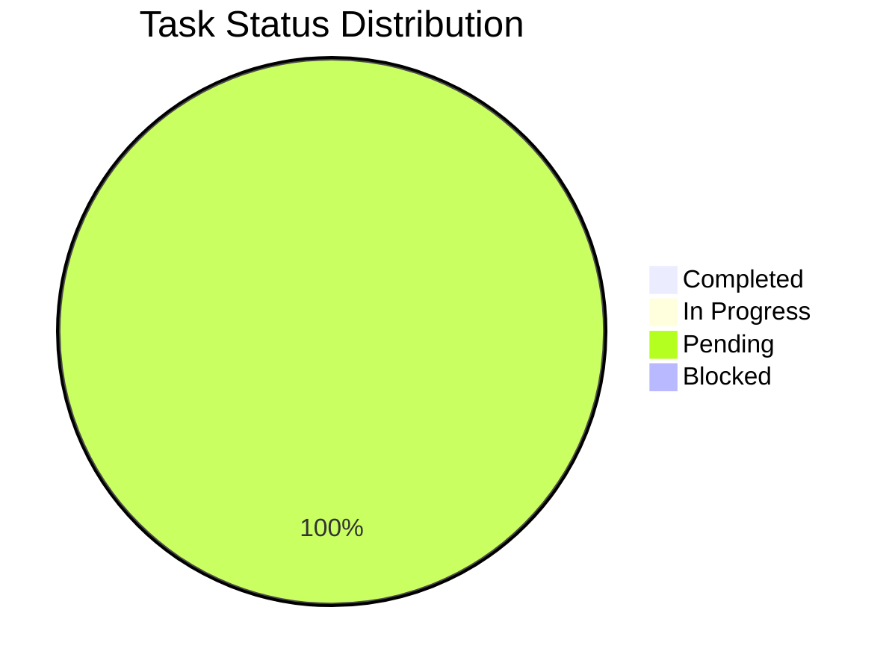
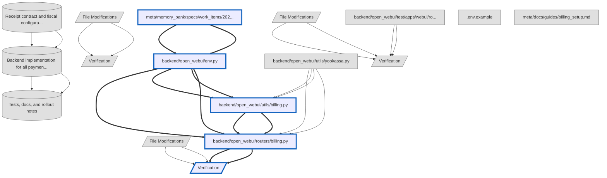

# YooKassa receipt for all payment flows (54-FZ compliance)

**Spec ID:** `yookassa-receipt-54fz-all-payments-2026-02-11-001`  
**Status:** pending  
**Progress:** 0/27 tasks (0%)  
**Complexity:** medium  

Fix provider payment rejection by adding fiscal receipt payload for all payment creation flows with configurable tax fields.

### Quick Stats

- **Progress**: 0/27 tasks (0.0%)
- **Phases**: 3 phases
- **Estimated Effort**: 6.0 hours total
  - Completed: 0.0h
  - In Progress: 0.0h
  - Remaining: 6.0h
- **Status Breakdown**:
  - ✅ Completed: 0
  - 🔄 In Progress: 0
  - ⏸️  Pending: 35
  - 🚧 Blocked: 0


## Objectives

- Send receipt payload in all YooKassa create_payment flows.
- Resolve customer contact deterministically using billing settings with account-email fallback.
- Expose tax receipt fields via env configuration and document how to fill them.
- Add regression tests for receipt payload propagation.

## Visualizations

### Progress Overview



### Dependency Overview



## Receipt contract and fiscal configuration (0/7 tasks, 0%)

**Purpose:** Define the receipt field contract and env-driven tax settings before implementation.  
**Risk Level:** medium  


### File Modifications (0/5 tasks)

#### ⏳ meta/memory_bank/specs/work_items/2026-02-11__bugfix__yookassa-receipt-54fz-all-payments.md - `meta/memory_bank/specs/work_items/2026-02-11__bugfix__yookassa-receipt-54fz-all-payments.md` - (0.5h)

**File:** `meta/memory_bank/specs/work_items/2026-02-11__bugfix__yookassa-receipt-54fz-all-payments.md`  
**Status:** pending  
**Estimated:** 0.5 hours  

#### ⏳ Capture provider error evidence and acceptance criteria

**Status:** pending  

**Details:** Document the exact YooKassa rejection and expected fixed behavior for all payment flows.

#### ⏳ Document legal/provider references for tax receipt fields

**Status:** pending  

**Details:** Record 54-FZ and YooKassa links used to determine required receipt fields.

#### ⏳ backend/open_webui/env.py - `backend/open_webui/env.py` - (0.5h)

**File:** `backend/open_webui/env.py`  
**Status:** pending  
**Estimated:** 0.5 hours  

**Blocked by:** task-1-1

#### ⏳ Add BILLING_RECEIPT_ENABLED flag

**Status:** pending  

**Details:** Toggle receipt payload generation without code rollback.

#### ⏳ Add configurable fiscal fields (vat/payment_mode/payment_subject)

**Status:** pending  

**Details:** Expose required YooKassa receipt fields via env.

#### ⏳ Add optional tax_system_code parsing

**Status:** pending  

**Details:** Support merchants who must send tax system code in receipts.


### Verification (0/2 tasks)

**Blocked by:** phase-1-files  

#### ⏳ Spec contract reviewed

**Status:** pending  
**Type:** manual  

**Command:**
```bash
Review work item acceptance criteria and legal/provider references.
```

**Expected:** Receipt contract is explicit and implementation-safe.

#### ⏳ Env variable definitions are parsable

**Status:** pending  
**Type:** auto  

**Command:**
```bash
python -m py_compile backend/open_webui/env.py
```

**Expected:** env.py compiles with new receipt settings.


---

__

---

## Backend implementation for all payment flows (0/12 tasks, 0%)

**Purpose:** Attach receipt payload and contact resolution across top-up/subscription/auto-topup.  
**Risk Level:** high  


### File Modifications (0/9 tasks)

#### ⏳ backend/open_webui/utils/yookassa.py - `backend/open_webui/utils/yookassa.py` - (0.5h)

**File:** `backend/open_webui/utils/yookassa.py`  
**Status:** pending  
**Estimated:** 0.5 hours  

#### ⏳ Extend create_payment with optional receipt argument

**Status:** pending  

**Details:** Keep request contract backward compatible and additive.

#### ⏳ Include receipt in outgoing payment payload when provided

**Status:** pending  

**Details:** Avoid affecting existing flows where receipt generation is disabled.

#### ⏳ backend/open_webui/utils/billing.py - `backend/open_webui/utils/billing.py` - (2.0h)

**File:** `backend/open_webui/utils/billing.py`  
**Status:** pending  
**Estimated:** 2.0 hours  

**Blocked by:** task-2-1, task-1-2

#### ⏳ Resolve receipt customer contact from user settings/email fallback

**Status:** pending  

**Details:** Priority: billing_contact_email/phone -> account email.

#### ⏳ Build reusable receipt payload helper

**Status:** pending  

**Details:** Construct customer/items/tax fields for a single-line receipt item.

#### ⏳ Attach receipt in subscription payment flow

**Status:** pending  

**Details:** Apply receipt to BillingService.create_payment.

#### ⏳ Attach receipt in wallet top-up flow

**Status:** pending  

**Details:** Apply receipt to BillingService.create_topup_payment.

#### ⏳ Attach receipt in auto-topup flow

**Status:** pending  

**Details:** Apply receipt to BillingService.create_auto_topup_payment.

#### ⏳ backend/open_webui/routers/billing.py - `backend/open_webui/routers/billing.py` - (0.5h)

**File:** `backend/open_webui/routers/billing.py`  
**Status:** pending  
**Estimated:** 0.5 hours  

**Blocked by:** task-2-2, task-1-2, task-2-1

#### ⏳ Return clear 400 for missing receipt contact

**Status:** pending  

**Details:** Map billing-level ValueError to user-safe actionable detail.

#### ⏳ Keep existing provider error mapping unchanged

**Status:** pending  

**Details:** Avoid regressions in 502 provider error normalization.


### Verification (0/3 tasks)

**Blocked by:** phase-2-files, task-2-3  

#### ⏳ Billing module compiles

**Status:** pending  
**Type:** auto  

**Command:**
```bash
python -m py_compile backend/open_webui/utils/billing.py backend/open_webui/utils/yookassa.py backend/open_webui/routers/billing.py
```

**Expected:** All touched backend files compile successfully.

#### ⏳ Phase 2 fidelity review

**Status:** pending  
**Type:** fidelity  

#### ⏳ Manual API behavior check

**Status:** pending  
**Type:** manual  

**Command:**
```bash
Trigger /billing/topup and verify no provider receipt error when contacts+tax config are valid.
```

**Expected:** Top-up payment creation returns confirmation_url instead of provider rejection.


---

_With the receipt contract and fiscal configuration in place, we now have the compliance rules, document formats, and accounting mappings needed to execute transactions consistently. This provides a clear foundation to move into backend implementation, where those definitions are applied across all payment flows to ensure correctness, traceability, and audit readiness._

---

## Tests, docs, and rollout notes (0/8 tasks, 0%)

**Purpose:** Cover regression risk and make fiscal env setup explicit for operators.  
**Risk Level:** medium  


### File Modifications (0/5 tasks)

#### ⏳ backend/open_webui/test/apps/webui/routers/test_billing_topup.py - `backend/open_webui/test/apps/webui/routers/test_billing_topup.py` - (1.0h)

**File:** `backend/open_webui/test/apps/webui/routers/test_billing_topup.py`  
**Status:** pending  
**Estimated:** 1.0 hours  

#### ⏳ Update fake YooKassa clients for new receipt argument

**Status:** pending  

**Details:** Keep existing tests compatible with additive payment argument.

#### ⏳ Add assertions for receipt payload in topup/subscription/auto-topup

**Status:** pending  

**Details:** Verify customer contact and fiscal fields are propagated.

#### ⏳ .env.example - `.env.example` - (0.5h)

**File:** `.env.example`  
**Status:** pending  
**Estimated:** 0.5 hours  

#### ⏳ Add receipt env variables with RU comments

**Status:** pending  

**Details:** Explain what each tax field means and who should provide values.

#### ⏳ Document contact fallback and when payment is blocked

**Status:** pending  

**Details:** Clarify that at least one customer contact is required for receipt.

#### ⏳ meta/docs/guides/billing_setup.md - `meta/docs/guides/billing_setup.md` - (0.5h)

**File:** `meta/docs/guides/billing_setup.md`  
**Status:** pending  
**Estimated:** 0.5 hours  

#### ⏳ Add fiscalization section with legal and YooKassa links

**Status:** pending  

**Details:** Show required steps for 54-FZ compliant receipt configuration.


### Verification (0/3 tasks)

**Blocked by:** phase-3-files, task-3-1  

#### ⏳ Targeted backend tests pass

**Status:** pending  
**Type:** auto  

**Command:**
```bash
docker compose -f docker-compose.yaml -f docker-compose.dev.yaml run --rm airis bash -lc "pytest -q open_webui/test/apps/webui/routers/test_billing_topup.py"
```

**Expected:** All billing topup tests pass with receipt coverage.

#### ⏳ Touched backend files pass ruff

**Status:** pending  
**Type:** auto  

**Command:**
```bash
docker compose -f docker-compose.yaml -f docker-compose.dev.yaml -f .codex/docker-compose.codex.yaml run --rm --no-deps pytools "python -m pip install -U pip >/dev/null && python -m pip install -q 'ruff>=0.1' && ruff check backend/open_webui/env.py backend/open_webui/utils/yookassa.py backend/open_webui/utils/billing.py backend/open_webui/test/apps/webui/routers/test_billing_topup.py"
```

**Expected:** Ruff reports no issues in touched backend files.

#### ⏳ Production smoke checklist prepared

**Status:** pending  
**Type:** manual  

**Command:**
```bash
Validate new .env receipt vars and create one top-up in prod after deploy.
```

**Expected:** Payment request accepted by provider and no receipt validation error in logs.
